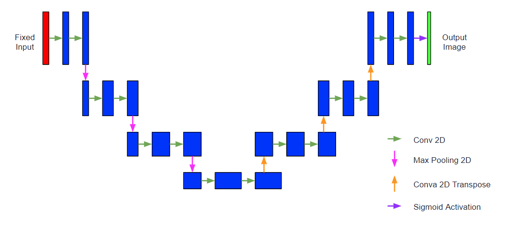
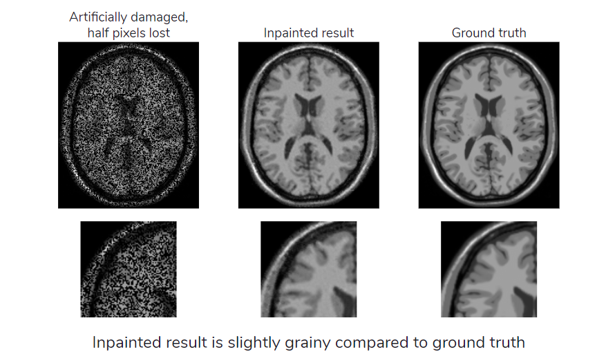
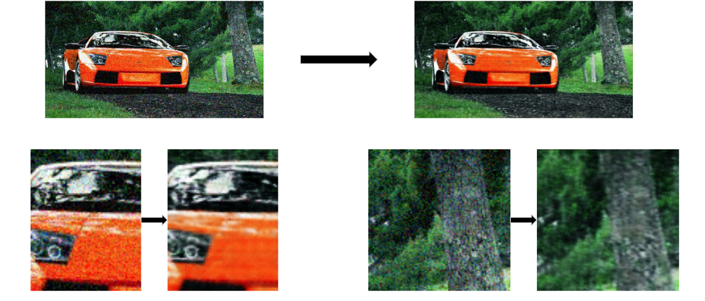
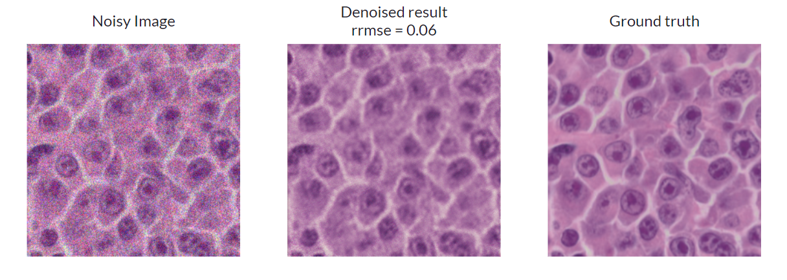
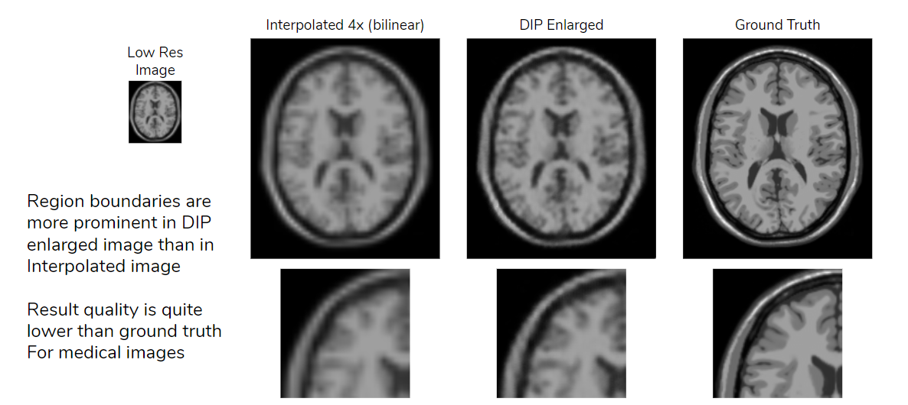

# Image-Restoration with Deep Image Prior
---

Mohammad Taufeeque, Anuj Srivastava

---

Image restoration is the operation of estimating an original image given a corrupted version of it.
In this repository we show how a technique called Deep Image Prior can be used to solve these inverse 
problems of image restoration.  
Deep Convolutional Networks are the most popular architecture in Image Processing.
The Deep Image Prior demonstrates the ability of such networks to estimate natural image features and statistics accurately to a large extent, even without any prior learning.
The Prior can be implemented as a model similar to the U-Net, with minor variations for the different methods of restoration mentioned previously.

## Installation
Make sure you have the following installed to run the code on your system:
- python >= 3.6
- tensorflow = 2.0
- numpy
- scipy
- matplotlib
- scikit-image
- jupyter

## Model Architecture for Prior

## Inpainting

 
 

## Denoising

## Super-Resolution

## Run on Google Colab
You can execute the whole code on Google Colab by clicking [here](https://colab.research.google.com/github/anuj27596/image-restoration/blob/master/image_restoration.ipynb).
Go ahead and upload your own images that you want to restore and experiment with this restoration method. Just remember to uncomment the first cell to clone the repository into colab's environment.

## Inspiration
The complete details for the method this project is based on can be found here:  
[Deep Image Prior by Dmitry Ulyanov, Andrea Vedaldi, Victor Lempitsky](https://dmitryulyanov.github.io/deep_image_prior)
